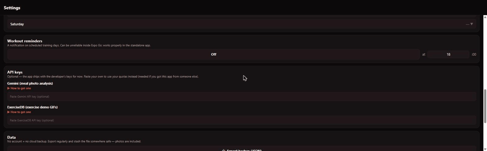

# IRONED ⚔️

A gamified workout tracker + AI meal logger, inspired by Hevy and Solo Leveling.
No login. No paywall. All data stays on your device.

## Features

- **Workouts**: custom plans, drag-to-reorder, per-set reps/weight, auto rest timer,
  supersets, machine/home exercise variants, animated demos with common-mistake warnings,
  plate calculator, pause/resume with honest timing
- **Gamification**: XP, levels, ranks E→S with an evolving companion pet, PR detection,
  tiered achievements, streaks (rest-day aware), level-up animations (bolt / slashes /
  screen-tear / wall-punch)
- **Meals**: photo → AI macro breakdown (multi-photo), barcode scanning
  (Open Food Facts + USDA fallback), calorie/protein/carb/fat/sodium goals with a
  research-based TDEE calculator, favourites & quick-add, water tracking
- **Progress**: weekly volume chart, per-exercise est. 1RM trends, calendar heatmap,
  body measurements + private progress photos
- **Yours**: 3 UI styles (Modern / Boxy / Alien) × 3 backgrounds × 5 accents, custom
  greeting, weekly or rotating-cycle schedules, JSON backups (photos included)

## API keys (free, optional)

Two features use free external APIs — you bring your own keys, entered inside the app
(**Settings → API keys**, with step-by-step guides):

| Feature | Provider | Where to get the key |
|---|---|---|
| Exercise demo GIFs | ExerciseDB (RapidAPI) | rapidapi.com → ExerciseDB → free Basic plan |
| Meal photo → macros | Google Gemini | aistudio.google.com → "Create API key" |



Everything else works without any keys.

## Updates

The app checks this repo's **Releases** for new versions
(Settings → About & updates). Releases are tagged `v1.2.3` with the APK attached.

## Development

```bash
npm install
cp src/lib/config.example.ts src/lib/config.ts   # keys optional
npx expo start --tunnel                           # Expo Go (SDK 57) on your phone
```

Build an APK (cloud, no Android SDK needed):

```bash
npm i -g eas-cli && eas login
eas build -p android --profile preview
```

See `DEV-GUIDE-OTHER-PC.txt` for the full setup, OTA-update workflow and quirks.

## License

MIT — exercise images from [free-exercise-db](https://github.com/yuhonas/free-exercise-db) (MIT).
